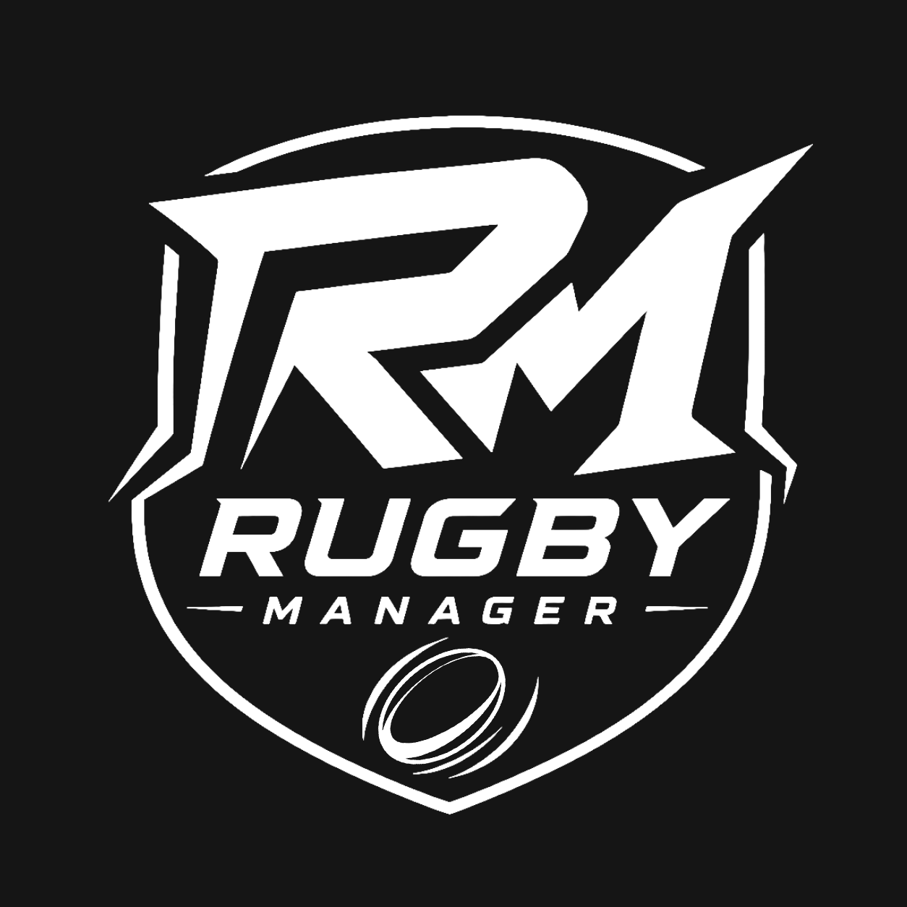

  

# 🏉 Rugby Manager

**Rugby Manager** is a rugby management simulation game inspired by genre-defining titles such as *Football Manager*.

Take control of a club, manage your squad, develop your facilities, recruit top talent, and build a team capable of conquering the world's most prestigious competitions.

Designed to deliver a deep and authentic rugby management experience, **Rugby Manager** combines strategic decision-making, financial management, scouting, player development, and realistic match simulation.

For too long, rugby fans have been overlooked when it comes to management simulation games. Our goal is to change that.

---

## 🛠️ Development Status

The game is currently in active development and is not yet available to the public.

Our current focus is building the core foundations of the experience:

* ⚙️ Club management systems
* 🏉 Match simulation engine
* 👥 Squad and player management
* 💰 Club finances and economy
* 📈 Player progression and talent development

Once these foundations are solid, we will gradually integrate comprehensive rugby data, including:

* Players
* Clubs
* Leagues
* Competitions
* Statistics

A major visual overhaul is also planned to enhance the user experience and establish a stronger, more immersive identity for the game.

**Rugby Manager is an ambitious project built by rugby fans, for rugby fans. Our mission is simple: create the ultimate rugby management simulation, accessible directly from your browser.**
